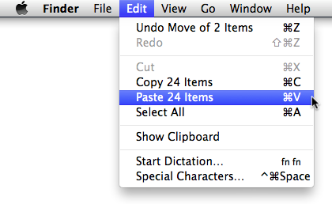
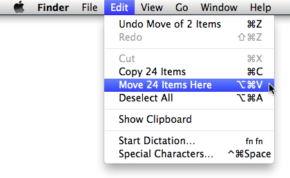
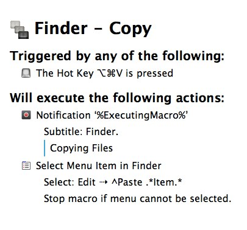
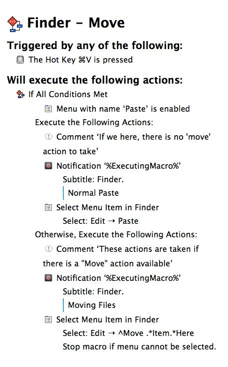

km-finder-move-or-copy
======================

Use Keyboard Maestro to swap ⌘+V and ⌘+⌥+V in Finder

The Finder allows you to move or copy files by choosing either:

⌘ + V to “paste” them:

 or 

⌘ + ⌥ + V to “move” them: 

Those commands are great, but I wanted to switch the keyboard shortcuts (because I almost always want to *move* the files). The obvious problem is that the menu item is *dynamic* meaning that it changes to show you how many items you will move or paste. That makes it impossible to change the keyboard shortcuts using the standard methods.

However, you *can* change the keyboard shortcut using [Keyboard Maestro][]. To do this, you will need *two* macros: one for copy, one for move.

### To Copy Files ###

For copying files, the command is fairly simple. We’re just going to trigger the menu “Paste Item” or “Paste X Items”: 

Download [Finder-Copy.kmmacros](https://raw.github.com/tjluoma/km-finder-move-or-copy/master/macros/Finder-Copy.kmmacros)

If you want to move files, you ned to match the menu item **^Move \.\*Item\.\*** so that it will match any of the options:

*	Move Item Here 
*	Move 3 Items Here
*	Move 4983 Items Here
*	etc

### To “Paste” (Move) Files ###

Paste is a little more complicated. That’s because there are times when you want ⌘ + V to be “Paste” and times you will want it to be “Move X Items Here.” 

The “trick” here is to check to see if the regular “Paste” menu is enabled, and if it is, use it.

If it isn’t, then we try the “Move X Items Here” menu instead.

Download [Finder-Move.kmmacros](https://raw.github.com/tjluoma/km-finder-move-or-copy/master/macros/Finder-Move.kmmacros).

[Keyboard Maestro]: http://www.keyboardmaestro.com/main/

